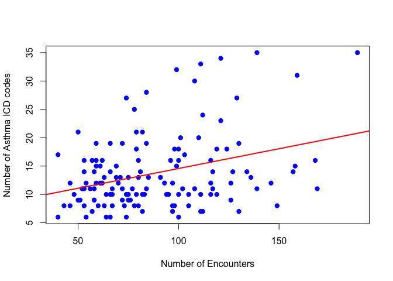
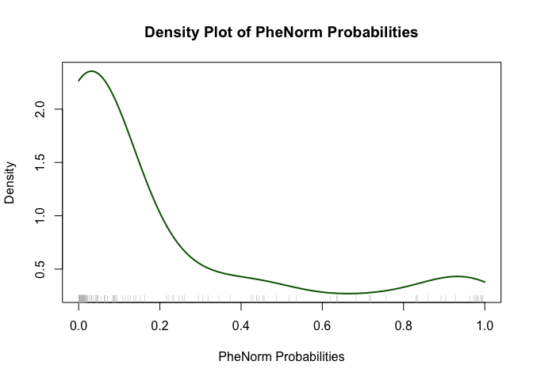

Phenorm i2b2 Workshop
================

PheNorm is an approach to deriving medical conditions (computed
phenotypes) using unsupervised learning. In this tutorial we will
evaluate demo EHR data from i2b2 consisting of a fictional cohort of
patients with asthma. We will transform the data into valid Phenorm
inputs and run the procedure utilizing the R PheNorm package. The goal
of this tutorial is to help students understand how to operationalize
PheNorm using EHR data.

This code is written in an rmarkdown notebook. You can step through this
code on your own in R by following these steps:

- To run locally, you will need to install
  [R](https://cloud.r-project.org/) and
  [RStudio](https://posit.co/download/rstudio-desktop/). MGB users may
  also use the MGB instance of Rstudio at
  <https://rstudio1.partners.org>.
- Download the files in the Github repository at
  <https://github.com/vcastro/phenorm_workshop>.
- Open phenorm_workshop.Rmd to step through the code.

## Load required R packages

Let’s start with loading the required R packages and scripts. The
PheNorm package is available on CRAN, the R library repository, which
makes it simple to install. PheNorm documentation is available at:
<https://celehs.github.io/PheNorm/>

``` r
install_and_load <- function(packages) {
  to_install <- packages[!packages %in% installed.packages()[, "Package"]]
  if (length(to_install)) install.packages(to_install)
  lapply(packages, library, character.only = TRUE)
}

install_and_load(c("dplyr", "here", "PheNorm"))

knitr::opts_chunk$set(
  fig.path = "figs/fig-"
)

# we set a random seed for reproducibility
set.seed(1234)

source(here("data/get_workshop_data.R"))
```

# Load data

We will extract the data from i2b2demodata instance at MGB and store at
as an R dataset for purposes of this demo. See workshop_data.sql script
for the SQL query used to extract data. The code below runs a function
that retrieves the data from the database if it doesn’t already exist
locally.

``` r
d <- get_workshop_data()
```

# Review the data

Let’s take a quick look at the data:

``` r
head(d)
```

    ##   patient_num sex_cd age_in_years_num num_enc num_asthma num_copd num_albuterol
    ## 1  1000000092      M               36      66         14        0             1
    ## 2  1000000024      M               27      61         15        0             0
    ## 3  1000000034      M               36      57          7        0             1
    ## 4  1000000016      F               23     116         12        0             0
    ## 5  1000000008      M               20     189         35        1             0
    ## 6  1000000087      M               52     119         10        0             0

The dataset contains a patient id (patient_num), sex, age, and 4 EHR
variables: num_enc is the number of healthcare encounters, num_asthma is
the number of asthma diagnosis, num_copd is the number of diagnosis for
COPD and num_albuterol is the count of albuterol drug prescriptions or
dispenses. We will utilize these 4 EHR variables to run the PheNorm
procedure.

Let’s look at a scatterplot of num_enc and num_asthma:

``` r
plot(d$num_enc, d$num_asthma,
     xlab = "Number of Encounters",
     ylab = "Number of Asthma ICD codes",
     pch = 19,        
     col = "blue")    

abline(lm(num_asthma ~ num_enc, data = d), col = "red", lwd = 2)
```

<!-- -->

# Transform the data

An important step is the need to log-transform all of the input
variables prior to running the method. This step is required to shift
our count variables into a gaussian (normal) distribution required for
our approach.

``` r
d_transformed <- d %>%
  dplyr::mutate(across(c(num_enc, num_asthma, num_copd, num_albuterol), log1p))

head(d_transformed)
```

    ##   patient_num sex_cd age_in_years_num  num_enc num_asthma  num_copd
    ## 1  1000000092      M               36 4.204693   2.708050 0.0000000
    ## 2  1000000024      M               27 4.127134   2.772589 0.0000000
    ## 3  1000000034      M               36 4.060443   2.079442 0.0000000
    ## 4  1000000016      F               23 4.762174   2.564949 0.0000000
    ## 5  1000000008      M               20 5.247024   3.583519 0.6931472
    ## 6  1000000087      M               52 4.787492   2.397895 0.0000000
    ##   num_albuterol
    ## 1     0.6931472
    ## 2     0.0000000
    ## 3     0.6931472
    ## 4     0.0000000
    ## 5     0.0000000
    ## 6     0.0000000

# Run PheNorm

Now that we have our data ready let’s run PheNorm! The PheNorm package
contains only one function: PheNorm.Prob that requires a few inputs:

- dat: the data.frame object name
- nm.utl: a string with the data.frame column name containing a
  log-transformed measure of healthcare utilization
- nm.logS.ori: a string with the data.frame column name containing
  log-transformed ICD code counts
- nm.X: a string vector of additional features to use for training.

(Note there a few other parameters, run `?PheNorm.Prob` in your R
session to see the full function documentation)

``` r
res <- PheNorm.Prob(
  dat = d_transformed[,c("num_enc", "num_asthma", "num_copd", "num_albuterol")],
  nm.logS.ori = "num_asthma",
  nm.utl = "num_enc",
  nm.X = c("num_copd", "num_albuterol")
)

# add the result to our data frame
d_transformed$PheNorm <- res$probs

head(d_transformed)
```

    ##   patient_num sex_cd age_in_years_num  num_enc num_asthma  num_copd
    ## 1  1000000092      M               36 4.204693   2.708050 0.0000000
    ## 2  1000000024      M               27 4.127134   2.772589 0.0000000
    ## 3  1000000034      M               36 4.060443   2.079442 0.0000000
    ## 4  1000000016      F               23 4.762174   2.564949 0.0000000
    ## 5  1000000008      M               20 5.247024   3.583519 0.6931472
    ## 6  1000000087      M               52 4.787492   2.397895 0.0000000
    ##   num_albuterol     PheNorm
    ## 1     0.6931472 0.222199413
    ## 2     0.0000000 0.305586226
    ## 3     0.6931472 0.001810033
    ## 4     0.0000000 0.022991084
    ## 5     0.0000000 0.983217406
    ## 6     0.0000000 0.005425310

We’ve run PheNorm and added the results to our dataframe. PheNorm
returns a probability (0..1) with the estimated probability of the
patient having the medical condition.

# Plot results

Let’s look at the distribution of the predicted probabilities in a
density plot.

``` r
# Density plot with x-axis constrained from 0 to 1
plot(density(d_transformed$PheNorm, from = 0, to = 1),
     main = "Density Plot of PheNorm Probabilities",
     xlab = "PheNorm Probabilities",
     xlim = c(0, 1),          # Constrain x-axis from 0 to 1
     col = "darkgreen",       
     lwd = 2)

# Add rug plot for individual data points
rug(d_transformed$PheNorm, col = "gray")
```

<!-- -->

# Gold standard evaluation

Although this approach is unsupervised it is still necessary to evaluate
our results against some gold standard (typically from a clinician chart
review).  
Here we’ll classify 22 patients as ‘No asthma’ and set the remaining
patients to ‘Yes asthma’. To compute specificity, sensitivity, and
positive predicted value (PPV), we’ll set patients with a
Phenorm-predicted probability of 0.5 or greater as ‘Yes asthma’,
otherwise ‘No Asthma’.

(A reminder that this data is fictional so these results will not make
sense but you can get an idea of how we compute evaluation metrics.)

``` r
noasthma_pts <- read.csv(here("data/noasthma_patients.csv"))$patient_num

# Add the truth and Phenorm cutoff column to a new data.frame
d_results <- d_transformed |> 
  mutate(truth = ifelse(patient_num %in% noasthma_pts, "N", "Y"),
         phenorm_cut = ifelse(PheNorm < 0.5, "N", "Y"))

# Create a 2x2 contingency table
conf_matrix <- table(Truth = d_results$truth, PheNorm = d_results$phenorm_cut)

# Print the contingency table 
print(conf_matrix)
```

    ##      PheNorm
    ## Truth  N  Y
    ##     N 22  0
    ##     Y 85 26

``` r
# Calculate sensitivity, specificity, and PPV
TP <- conf_matrix["Y", "Y"]  # True Positives
FP <- conf_matrix["N", "Y"]  # False Positives
FN <- conf_matrix["Y", "N"]  # False Negatives
TN <- conf_matrix["N", "N"]  # True Negatives

sensitivity <- TP / (TP + FN)
specificity <- TN / (TN + FP)
ppv <- TP / (TP + FP)

# Print results
cat(paste0(
  "Sensitivity:", round(sensitivity, 3), "\n",
  "Specificity:", round(specificity, 3), "\n",
  "Positive Predictive Value (PPV):", round(ppv, 3), "\n"
))
```

    ## Sensitivity:0.234
    ## Specificity:1
    ## Positive Predictive Value (PPV):1

# Conclusion

In this tutorial, we’ve run Phenorm on fake EHR data and evaluated the
results. The steps in this notebook are generally the steps used to
generate the computed phenotypes in the RPDR. Read more about the RPDR
computed phenotypes at <https://phenotypes.partners.org>.

Feel free to reach out via email at <vcastro@mgb.org> with any
questions.
